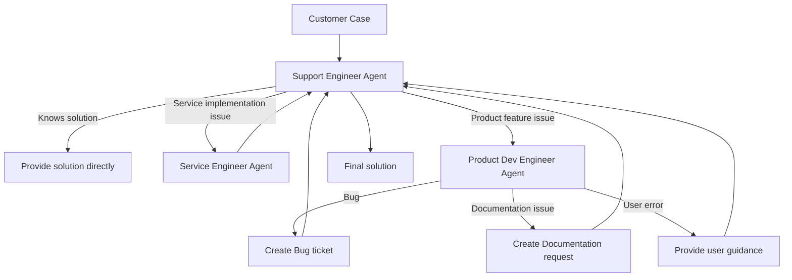

# Support Case Handling Agent System

This project uses the OpenAI Agents SDK to implement a support case handling system that resolves customer issues through collaboration between multiple specialized agents.

## System Architecture



## Agent Design

### 1. Support Engineer Agent
- **Responsibilities**: Receive customer cases, perform initial analysis and triage
- **Capabilities**:
  - Solve known issues
  - Collaborate with other specialized agents
  - Integrate information and provide final solutions
- **Tools**:
  - Check case details
  - Query knowledge base
  - Create Bug tickets
  - Create Documentation request tickets

### 2. Service Engineer Agent
- **Responsibilities**: Provide specialized knowledge related to service implementation
- **Capabilities**:
  - Analyze service configuration issues
  - Provide service implementation recommendations
  - Diagnose service-related errors
- **Tools**:
  - Check case details
  - Query knowledge base

### 3. Product Development Engineer Agent
- **Responsibilities**: Analyze product feature-related issues
- **Capabilities**:
  - Determine if an issue is a bug, missing documentation, or user error
  - Provide technical analysis and solution recommendations
- **Tools**:
  - Check case details
  - Query knowledge base

## Handoff Process

1. Support Engineer receives customer case
2. If Support Engineer knows the solution, provides it directly
3. If service implementation is involved, hands off to Service Engineer for expert opinion
4. If product feature is involved, hands off to Product Development Engineer for analysis
5. Product Development Engineer determines issue type:
   - Bug: Support Engineer creates Bug ticket
   - Documentation issue: Support Engineer creates Documentation request
   - User error: Support Engineer provides correct usage guidance
6. Support Engineer integrates all information and provides final solution to customer

## Example Cases

The system includes the following example cases:

1. **Case 1**: Problem that Support Engineer can solve directly (API connection timeout)
2. **Case 2**: Problem requiring Service Engineer assistance (data synchronization failure)
3. **Case 3**: Problem requiring Product Development Engineer assistance, in three scenarios:
   - Bug: Refresh button not responding, console showing JavaScript errors
   - Documentation issue: Missing documentation for auto-refresh feature
   - User error: Mistakenly believing data should update automatically

## Usage

1. Ensure OpenAI Agents SDK is installed
2. Run the `support-agents.py` file:
   ```
   python support-agents.py
   ```
3. The system will automatically process the example cases and display the handling process and results

## Mock Features

- **Azure DevOps Tickets**: The system simulates creating Bug tickets and Documentation request tickets
- **Knowledge Base**: The system includes a mock product knowledge base providing common issues and troubleshooting steps
- **Support Case Database**: The system includes mock support case data

## Code Structure

- **Mock Data**: Support cases, knowledge base, Azure DevOps ticket system
- **Tool Functions**: Check case details, query knowledge base, create tickets
- **Agent Definitions**: Support Engineer, Service Engineer, Product Development Engineer
- **Handoff Setup**: Define handoff relationships between agents
- **Main Function**: Core logic for handling support cases
- **Example Run**: Demonstrate handling process for different types of cases
